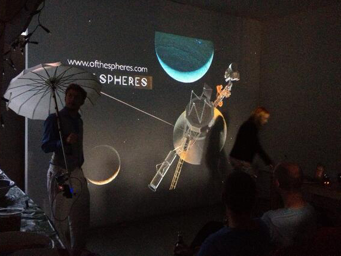
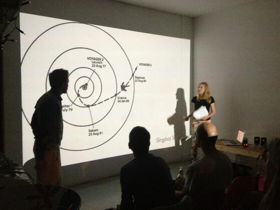

Kate Genevieve and Paul Hayes talk about the questions and research behind Of the Spheres and the open call out for publicly created content during Brighton’s Digital Festival 2013.

There is widespread speculation as to when NASA’s Voyager 1 spacecraft will complete its journey across the heliosphere, the bubble-like boundary of charged particles marking the outer limits of our solar system.  CHRΘMA’s Of the Spheres is an AudioVisual art project exploring the extended reach of technological communication and the new perspectives on earth that the Voyager probes give us.  

Of the Spheres experiments with using the data from Voyager 1′s camera, electromagnetic and plasma wave instrumentation, and mixing it with the contents of the Golden Record that the Voyager probe is carrying away from earth.  During the Brighton Digital Festival CHRΘMA is asking what this optimistic act of sharing information might mean for the Internet age by opening up the project to the public. An open call out asks people from around the globe to send in their own vistas of earth during the month of September and to experiment with blending and re-mixing these vistas to create alternative visions of our planet in this current moment.
