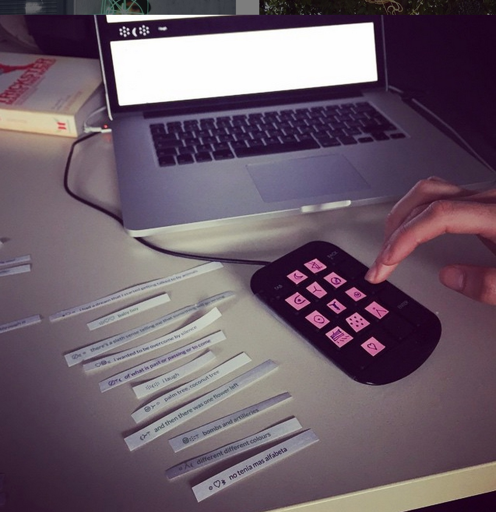
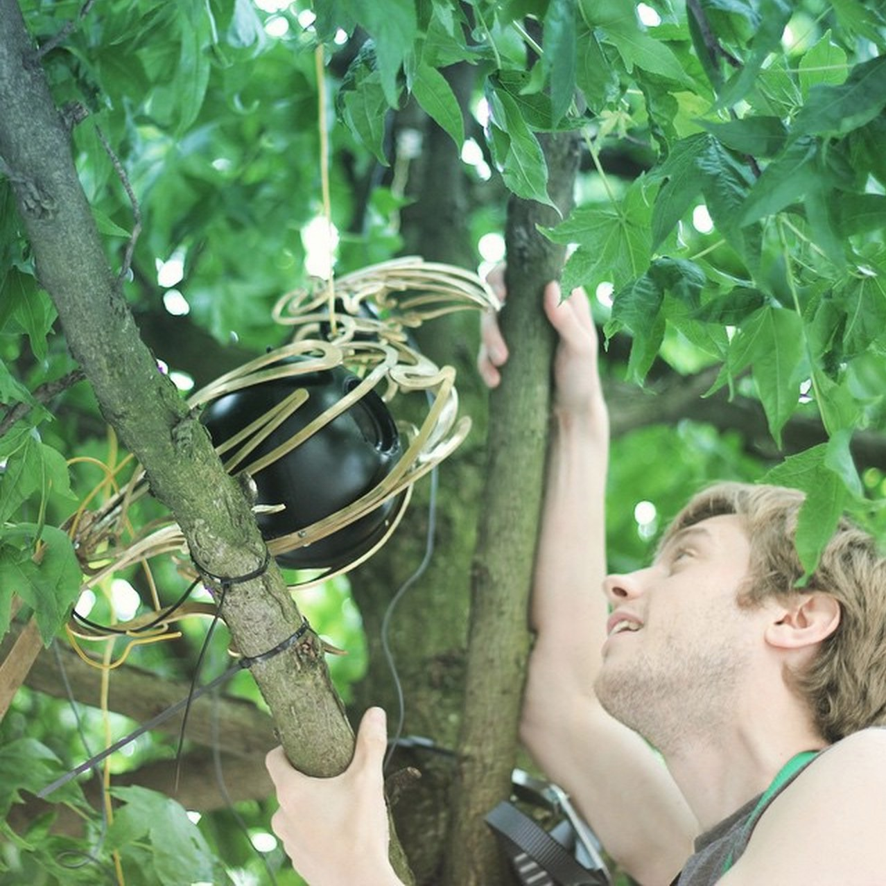
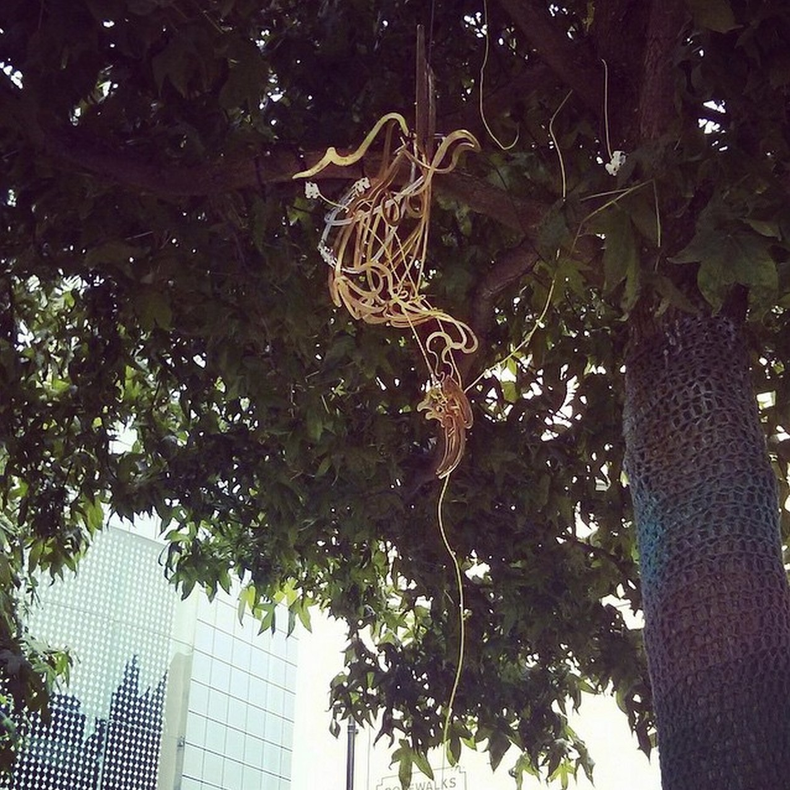
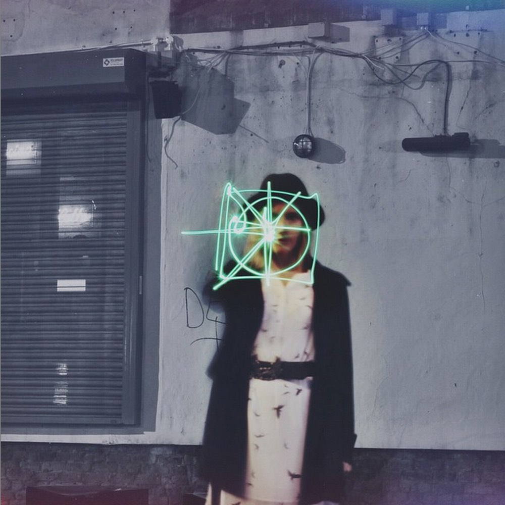
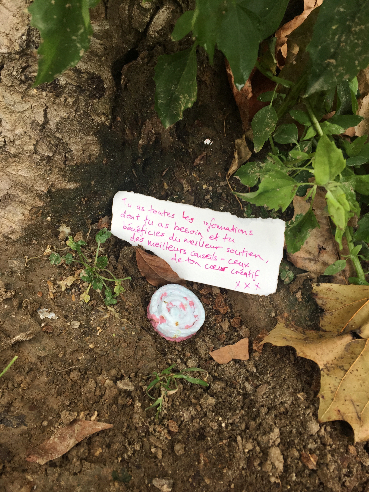
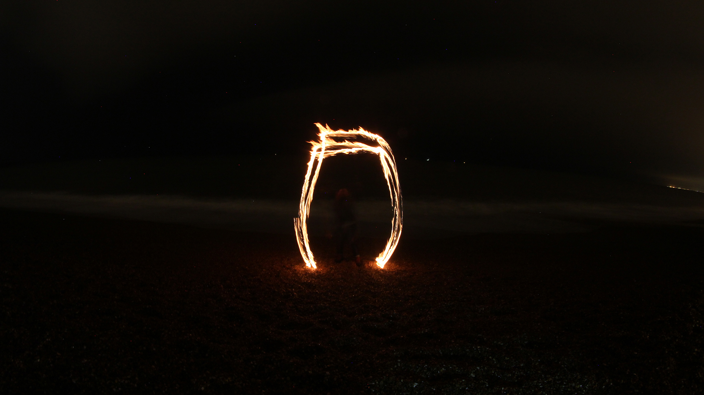

Byzantium is a sound experiment investigating visionary language, birdsong and participatory algorithms. The development of Byzantium during "Build Your Own: Tools for Sharing" invites the public into the [FACTLab](http://www.fact.co.uk/projects/factlab.aspx) to co-create oracles. This project is part of CHRΘMA's running experiment into technological circuits and symbolic, expressive language. Inspired by the historical concept of the "Language of the Birds" or the "green language", a natural and symbolic language of vital communication that exists within everyday words and spoken by birds.  This notion of a magical creative, language runs like a green seam through various cultures and myths. 

In 2015 network technology is increasingly used by companies to crowd-source human beings as isolated working components of large automated systems, designed to produce commercial content and financial profit. We want to vision alternatives that are for ecology: can the living earth and animal populations be heard amidst the clamour of the city?

Inspired by divination and the poetry of Yeats, we have been making this project at the FACTLab - exploring participatory algorithms and group utterance as we build. Open to all, people who came into the FACTLab could cast their own oracles using printed fragments of spoken word recordings of voices from Liverpool. 

These "oracles" were to be voiced by the golden bird in the tree in front of FACT. Conceived and recorded by Kate Genevieve, designed by Will Scobie, with metal work by Piers Mason & Paul Hayes creating the bird's magical innards & installing it in the tree.

Sadly, the bird was vandalised in the night. The bird was pulled apart by someone wanting to break into the inner sphere, this sphere simply held some cheap electronics and speakers, the value was in the whole. We were pretty shaken by the news after all the work & care and it was especially sad for Paul who worked so many days refining this system &amp; this bird to sing of alternatives.

We started the project with a late night sigil drawn outside the gallery that held our hopes for creative technology. Sometimes it's a difficult journey to creatively work with technology in a way that holds values of sharing & ecology - much of the world runs to an altogether more commercial value system. But the tendency towards destruction has to be taken into any investigation of shared creativity, it is part of it and it is a tough lesson. 

The project ran inside the FACT Lab with burning sage and electronics. People entered into the ritual of casting oracles. [here: http://byzantium.chroma.space](http://byzantium.chroma.space) New possibilities emerge from the destruction: possibilities we could not have foreseen or thought up. 

This broken communication led on to C A S C A D E  http://cascade.network/: an experiment in creative activism & storytelling - created across many different media streams by many different people - imagining into alternative futures on earth at this time. C A S C A D E started by letting go of the plans we had and beginning again. Singing to the water in Hastings in mid-Winter 2015 we performed a digital ritual to open up a portal to alternative futures at a natural spring:  https://soundcloud.com/ofspheres/cascade

This creative flow took us to the streets of Paris during the COP21 - the 2015 United Nations Climate Change Conference - story telling, chalking doors, planting seeds, sending messages.  A self-organised, collaborative experiment, that grew into a series of creative workshops on Buckminster Fuller & group synergetics, transmedia storytelling, cybernetics and hacking reality.   

⸫ ⱡ ꒫ ⿴ ☼☽ A flaming door appears in the city - it's wide open & we don't know where it leads : ◌ ◎ ● ☉◗◖◯ ֯