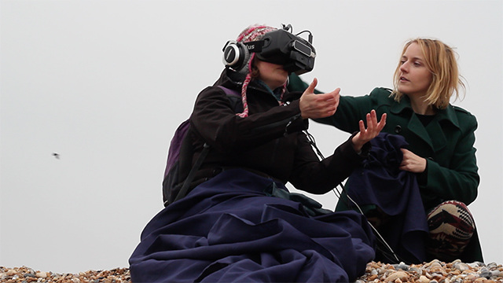

Fresh additions to [Of the Spheres](ofthespheres.com)

Inspired by Voyager 1's journey into intergalactic space, Of the Spheres explores contemporary understandings of our planet and the cosmos and the human attempt to communicate life on earth.

TRUST

AV installation experienced through hacked headphones, structures and screens as listening posts for life on earth and beyond. Showing during [Technology Not Neutral](http://technologyisnotneutral.com/) in London and Brighton 2016.

CONJUNCTION 

On March 20th 2015 England witnessed a partial solar eclipse. Intrigued by the spectacle of the black sun that can not be looked at with the naked eye, we built a virtual reality performance as a way of marking and witnessing the event.

Research into how ancient cultures understood this specific cosmological conjunction inspired us to create a virtual experience that explored the moon and the eclipse symbolically and mathematically. Made for outside viewing, we incorporated a live web cam into the virtual experience so that the viewer can see the eclipse occur in the sky above them.

An untimely collaboration with cosmic bodies, typical english weather and a generous amount of humour. We assembled a group down on Brighton beach to sample this experience - the “live” eclipse was mostly obscured by thick cloud, but the virtual experience had promise. We are continuing development and will release this experience as an app for future eclipse viewings.

