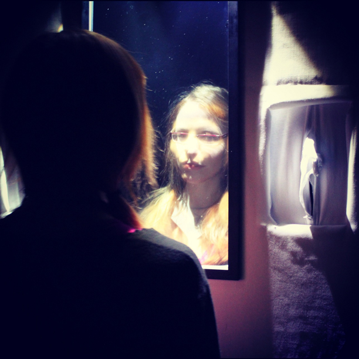

Falling Through Myself is movement based performance research exploring the connection between conscious presence and embodiment through visual technologies and staged illusions. In January 2012 Kate Genevieve and Choreographer Genevieve Maxwell completed an R&D workshop at the Sackler Centre for Consciousness Science with a series of meetings with Neuroscientists Dr Anil Seth and Dr Keisuke Suzuki structured around their research into the neurocognitive mechanisms of conscious presence.

In 2012 Kate Genevieve and Choreographer Genevieve Maxwell began collaborating on "Falling Through Myself" to explore the multiple sensations of falling through movement and interactive technology. Genevieve Maxwell is a Dance/Movement artist and Choreographer, with a practice rooted in Anthropology and Somatics. Genevieve and Kate both fell and broke parts of their backs some years ago, an experience which led both of them to an ‘out of body experience’ during the fall, encouraging a line of enquiry into where and how movement can be felt. The rituals experienced directly after their falls contrasted greatly, from Kate’s Ayahuasca ritual in the Amazon Rainforest, to Genevieve’s alienating NHS experience and subsequent disability. Together they explored visual technologies, staged illusions and the manipulation of relational space through choreographic means to simulate a falling experience in audience members within a performance.

The workshop was funded by a bursary from PAL’s [Movement and Meaning Lab](http://www.pallabs.org/our-work/pal-arts/lab-1/movement-meaning-press-release/) , an on-going experimental research process into embodied practice set up by Gill Clarke MBE. The workshop involved collaboration with artists Valerie Furnham, Rachel Alexander and Jon Gilhooly.

##IMPULSE
Impulse is a live art installation exploring the connection between conscious presence and embodiment by artist Kate Genevieve and creative technologist Alex Peckham with performance by Rachel Blackman.   

	
Impulse, for the ASSC16 conference at the Brighton Dome, uses theatrical illusion techniques in combination with contemporary bio-sensing technology.  The installation, installed on the Mezzanine level in the Dome Foyer throughout the conference, reacts to the pulse of individual participants, and creates for the audience an unusual encounter with their own heart. 

This project was created during Kate Genevieve’s residency at the Sackler Centre for Consciousness Science in collaboration with Dr Anil Seth and Dr Keisuke Suzuki.  Over her residency Kate is creating projects that explore the Sackler’s new model of conscious presence that links the feeling of presence with interoceptive awareness. 

This work is funded by [Arts Council England](http://www.artscouncil.org.uk/) and emerges out of a research residency with dance artist Genevieve Maxwell exploring staged illusions and embodiment as part of PAL’s Movement and Meaning Lab. 

This installation was first shown, with the working title of Latent Heart, at [Konnecting Gestures 2: Artaud Forum](http://people.brunel.ac.uk/dap/artaudforum.html). The project involved collaboration with a number of artists, scientists and dancers including Valerie Furnham, Sophie Hogrefe, Paul Hayes, Keisuke Suzuki, Vjeran Salamon and Daisy Jordan. 

