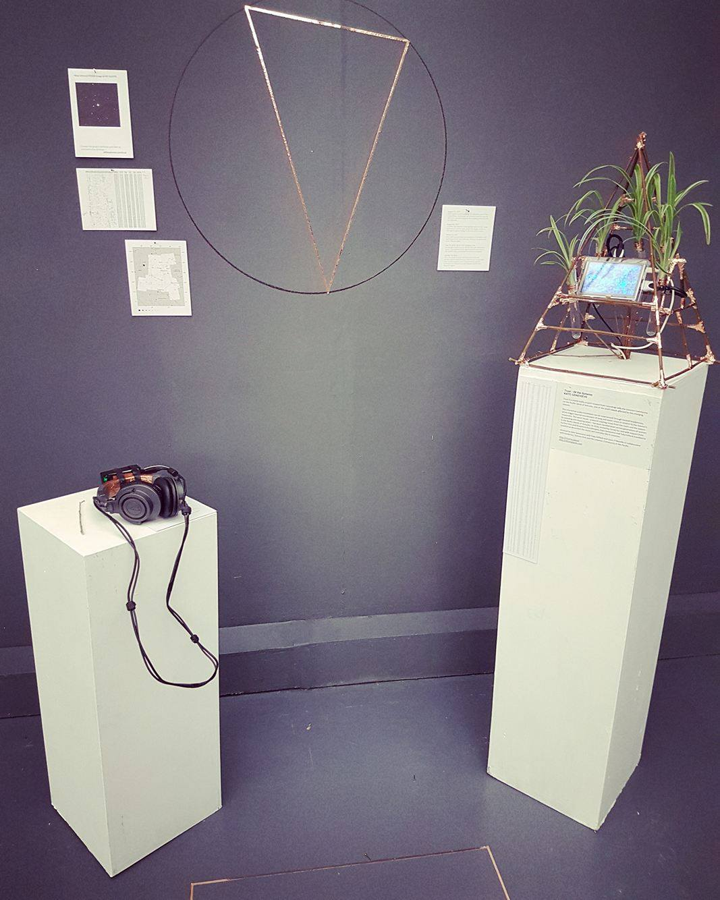
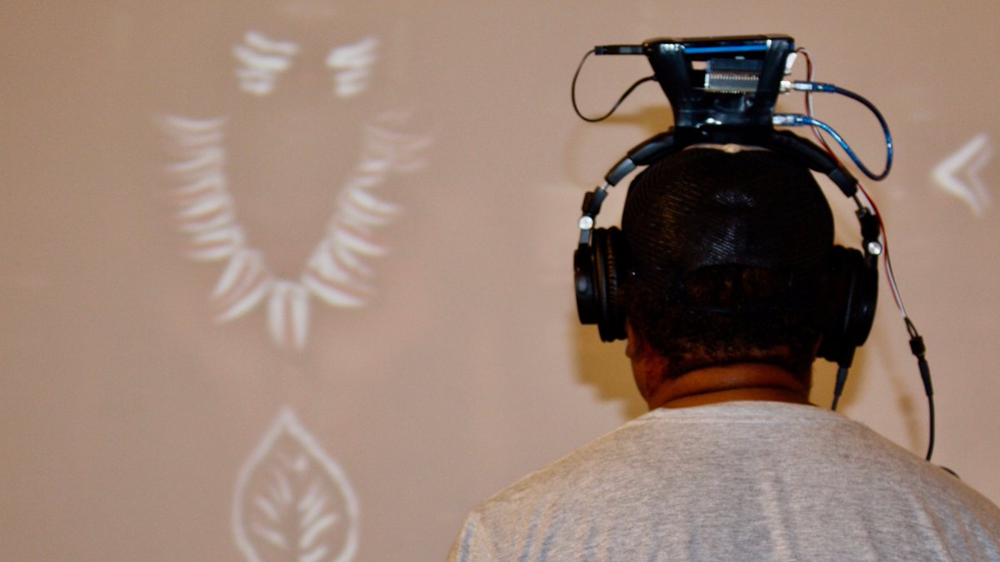
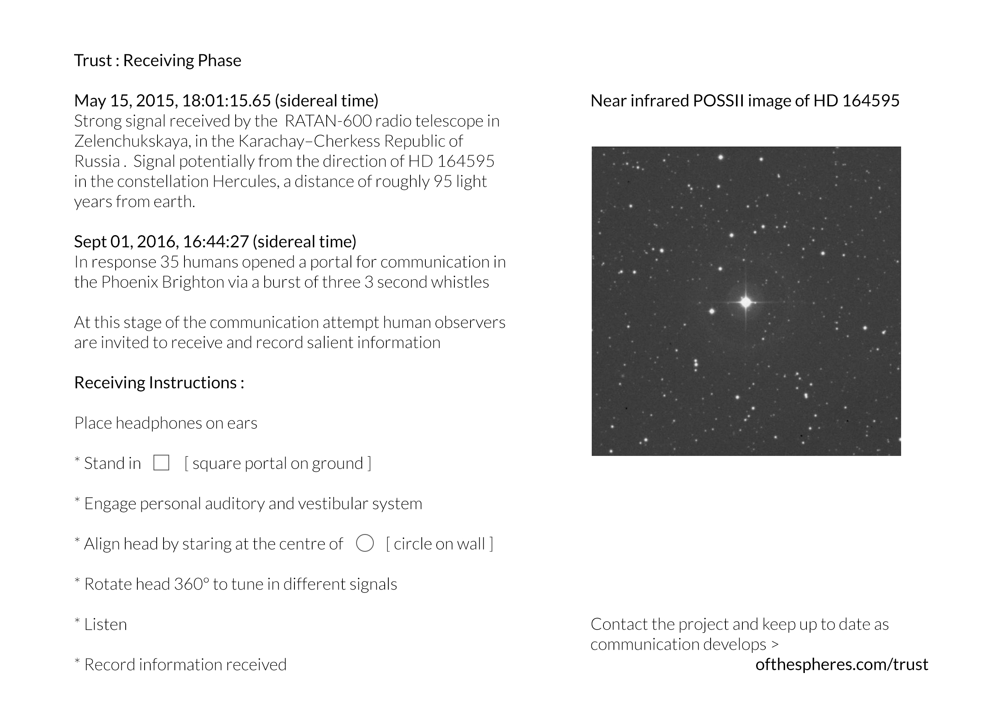

AV installation experienced through hacked headphones, structures and screens as listening posts for life on earth and beyond. Showing during [Technology Not Neutral](http://technologyisnotneutral.com/) in London and Brighton 2016.

Fresh additions to [Of the Spheres](ofthespheres.com) 

Blog of project development at [ofthespheres.wordpress.com](http://ofthespheres.wordpress.com)

Inspired by Voyager 1's journey into intergalactic space, Of the Spheres explores contemporary understandings of our planet and the cosmos and the human attempt to communicate life on earth.

